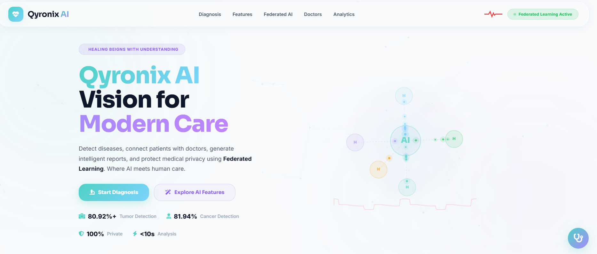
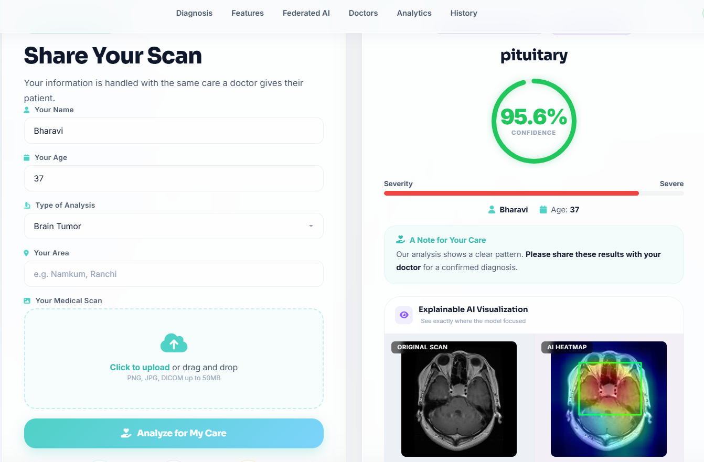
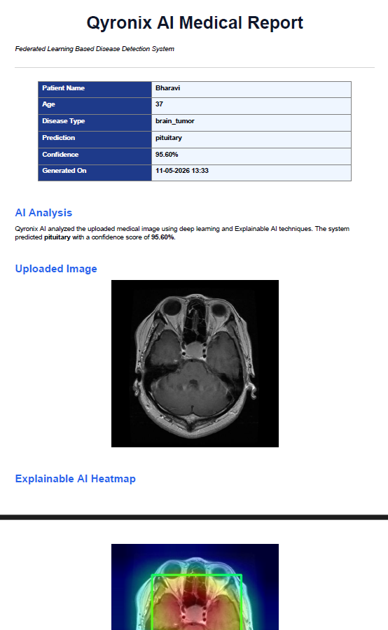
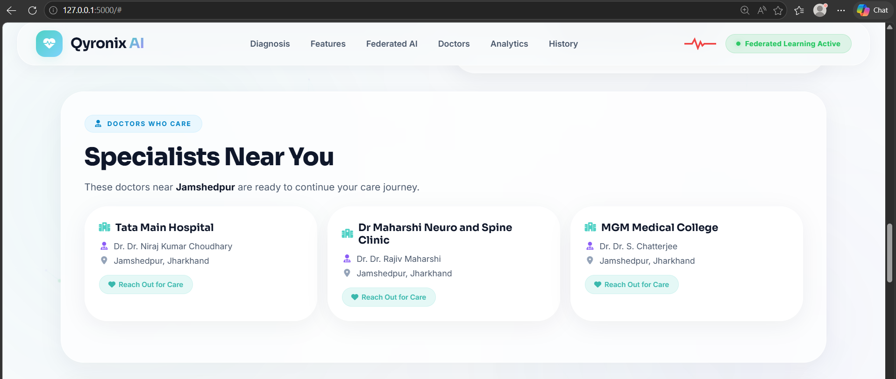

# 🩺 Qyronix AI

## 📌 Federated Learning Based Multi-Disease Detection System

> The platform aims to bridge the gap between artificial intelligence and modern healthcare by creating a system that is not only accurate and intelligent, but also privacy-aware and user-friendly.
Qyronix AI allows users to upload medical images such as MRI scans, retina images, and skin lesion images for disease analysis. The system processes these images using deep learning models trained on medical datasets and predicts possible diseases with confidence scores.
To improve transparency and trust in AI predictions, the platform integrates Explainable AI using Grad-CAM visualization. This enables users and healthcare professionals to visually understand which regions of the image influenced the AI model during prediction.

---

# ✨ Features

## 🧬 Multi-Disease Detection

Qyronix AI supports detection of multiple diseases using deep learning models.

| Disease | Detection Type |
|---|---|
| Brain Tumor | MRI Image Classification |
| Diabetic Retinopathy | Retina Scan Analysis |
| Skin Cancer | Skin Lesion Detection |

---

## 📍 Explainable AI

The platform uses Grad-CAM visualization to highlight important regions responsible for AI predictions.

###  Benefits

- Improves transparency
- Makes AI trustworthy
- Helps doctors understand predictions
- Enhances interpretability

---

## 📄 AI Medical Report Generation

The system automatically generates professional PDF reports containing:

-  Patient Information
-  Disease Prediction
-  Uploaded Medical Image
-  Grad-CAM Heatmap
-  Timestamp
-  Medical Disclaimer

---

## 🏥 Nearby Hospital Recommendation

The platform recommends nearby hospitals based on:

-  User Location
-  Disease Type
-  Distance

---

## 🔒 Federated Learning Concept

Instead of sharing raw patient data:

- Training occurs locally
- Only model weights are shared
- Patient privacy is preserved
- Healthcare security is improved

---

# 💻 Technologies Used

| Category | Technologies |
|---|---|
| Frontend | HTML, CSS, JavaScript |
| Backend | Flask |
| Deep Learning | PyTorch |
| Computer Vision | OpenCV |
| Image Processing | PIL |
| Explainable AI | Grad-CAM |
| PDF Generation | ReportLab |
| Geolocation | Geopy |
| Model Architecture | ResNet18 |

---

# ✦ Deep Learning Workflow

```text
Medical Image Upload
          ↓
Image Preprocessing
          ↓
Disease-Specific AI Model
          ↓
Prediction + Confidence Score
          ↓
Grad-CAM Heatmap Generation
          ↓
Hospital Recommendation
          ↓
AI PDF Report Generation
```

---

# ⚡ Installation Guide

## 1️⃣ Clone Repository

```bash
git clone https://github.com/SHRISTI-125/Qyronix-AI
```

---

## 2️⃣ Move Into Project Directory

```bash
cd Qyronix-AI
```

---

## 3️⃣ Install Dependencies

```bash
pip install -r requirements.txt
```

---

## 4️⃣ Run Flask Application

```bash
python app.py
```

---

## 5️⃣ Open Browser

```text
http://127.0.0.1:5000
```

---

# 📂 Folder Structure

```text
Qyronix-AI/
│
├── app.py
├── acc.py
├── requirements.txt
├── report.pdf
│
├── models/
│   ├── brain_model.pth
│   ├── dr_model.pth
│   └── skin_model.pth
│
├── datasets/
│
├── static/
│
├── templates/
│   ├── index.html
│
└── README.md
```

---

# 📊 Accuracy Evaluation

The project uses:

- Accuracy Score
- F1-Score
- Confusion Matrix


---

# 📈 Sample Accuracy Results

| Model | Accuracy |
|---|---|
| Brain Tumor Detection | 80.92% |
| Diabetic Retinopathy | 93.2% |
| Skin Cancer Detection | 81.94% |

---

# 🎨 User Interface

Qyronix AI follows a futuristic healthcare UI theme.

---

# 🔐 Security & Privacy

Qyronix AI prioritizes patient privacy using Federated Learning concepts.

### 🛡 Key Concepts

- Local AI training
- No raw data sharing
- Secure healthcare workflow
- Privacy-aware AI system

---

# 🚀 Future Enhancements

Future scope of the project includes:

-  Cloud Deployment
-  Mobile Application
-  AI Medical Chatbot
-  Live Doctor Consultation
-  Multi-language Support
-  Advanced Analytics Dashboard

---

# ⚠ Challenges Faced

Major challenges during development:

- Training medical image datasets
- Building Grad-CAM visualizations
- Managing multiple AI models
- PDF generation system
- Geolocation integration
- Designing medical-friendly UI

---

# 📚 Learning Outcomes

This project helped in understanding:

- Deep Learning workflows
- CNN architectures
- Explainable AI
- Flask backend integration
- Medical AI systems
- Healthcare privacy concepts

---

# 🧪 Research Contribution

Qyronix AI explores the intersection of:

-  Healthcare
-  Artificial Intelligence
-  Federated Learning
-  Explainable AI
-  Computer Vision

The project demonstrates how AI can assist healthcare professionals while maintaining patient privacy.

---

# 📸 Screenshots


<table align="center">

<tr>

<td>

</td>

<td>

</td>

</tr>

<tr>

<td>

</td>

<td>

</td>

</tr>

</table>

---

# 🎬 Live Demo
[Qyronix AI](https://huggingface.co/spaces/shristi222/Qyronix-AI)

---

# 👩‍💻 Developer

## Shristi Kumari

---

# ⚠ Disclaimer

Qyronix AI is an AI-assisted healthcare support system.
The generated predictions are not a replacement for professional medical diagnosis.
Always consult certified healthcare professionals before making healthcare decisions.

---

# ⭐ Support

If you liked this project:
- ⭐ Star the repository
- 🍴 Fork the project
- 🚀 Contribute improvements

---

# 📢 Thank You

Thank you for exploring Qyronix AI.

> Building intelligent healthcare systems for a smarter future.
